# 📄 Alke Wallet - Base de Datos Relacional

Curso: Desarrollo de Aplicaciones Fullstack Python Trainee. 

Módulo: Fundamentos de Bases de Datos Relacionales. 

Profesor: Ariel Rosenamnn. 

Alumno: Roberto Otárola. 

1. Creación de la base de datos
📸 [Capturas de pantalla de la ejecución de CREATE DATABASE "AlkeWallet"; y del panel izquierdo de DBeaver mostrando la BD]
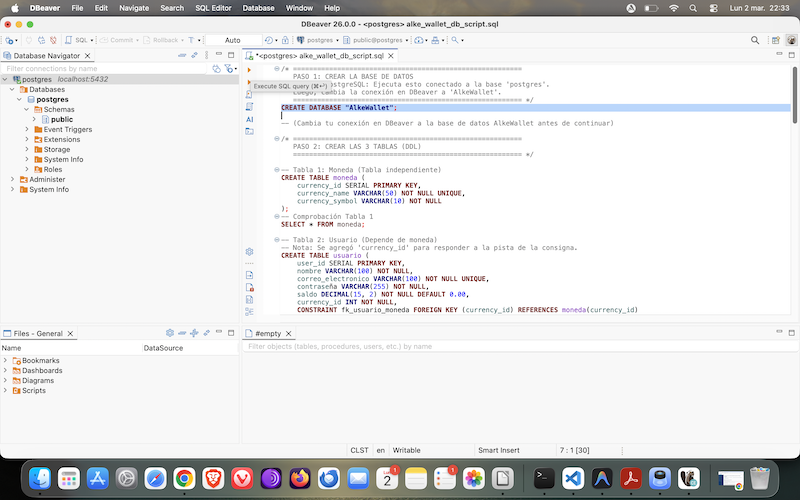
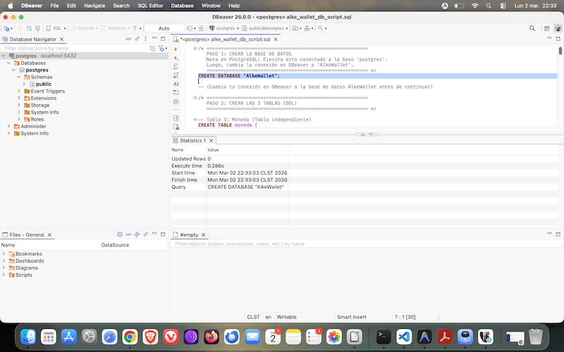
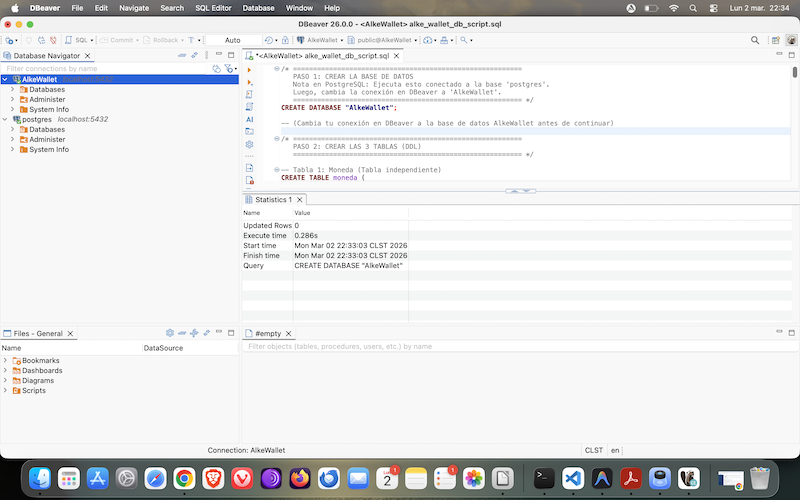

2. Creación de tablas
📸 [Capturas de pantalla de las tres tablas creadas]
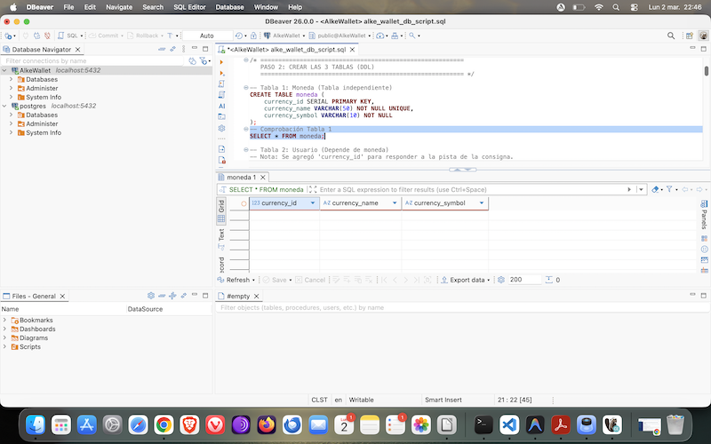
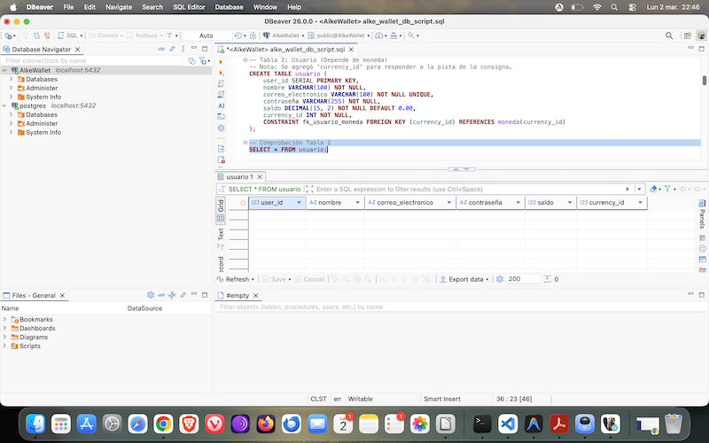
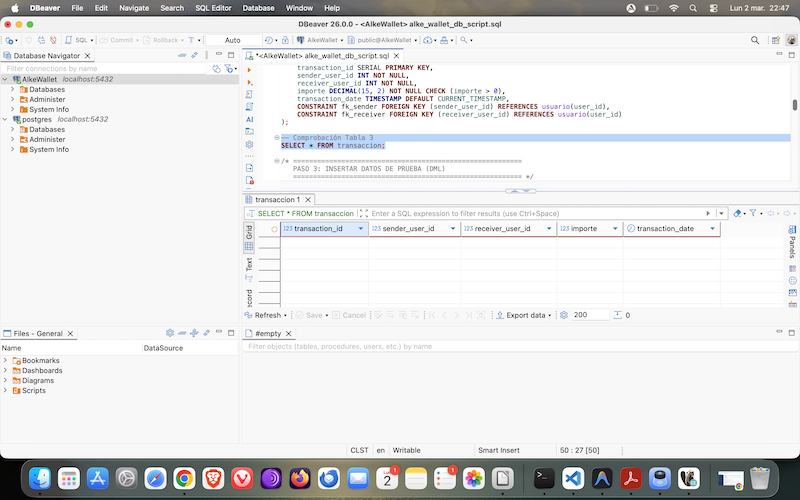

3. Inserción de datos
📸 [Capturas de pantalla de los resultados de SELECT * FROM usuario;, SELECT * FROM moneda; y SELECT * FROM transaccion; después de insertar los datos de prueba]
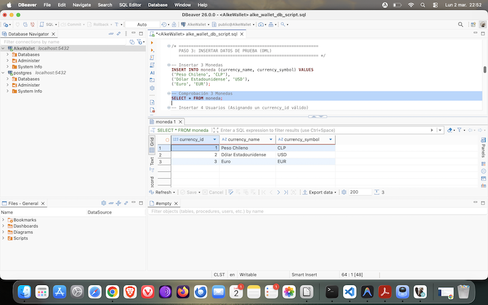
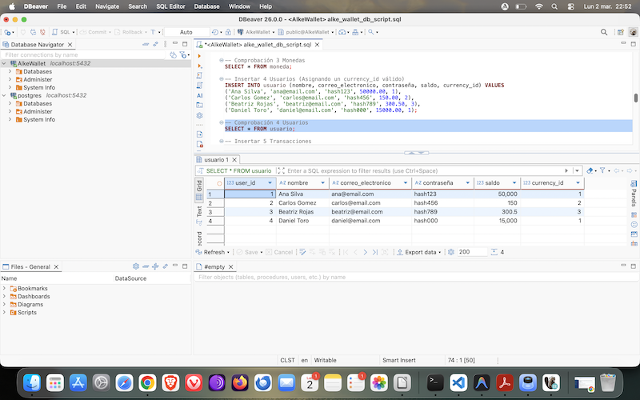
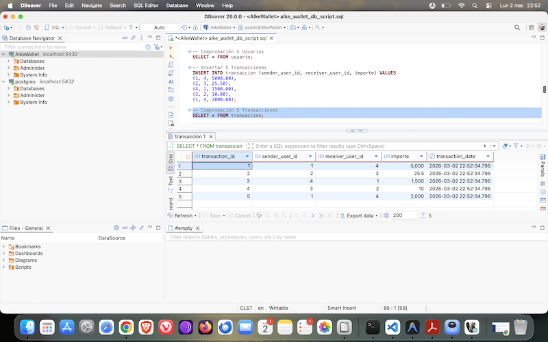

4. Consultas requeridas
    1. Moneda de un usuario:
    📸 [Captura de pantalla del resultado de la consulta]
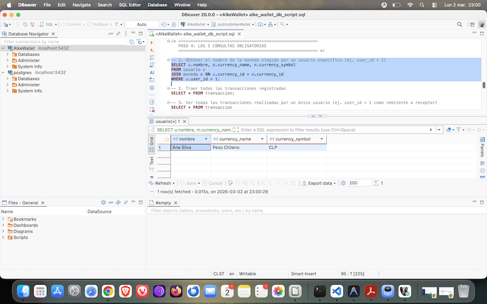

    2. Todas las transacciones:
    📸 [Captura de pantalla del resultado de la consulta]
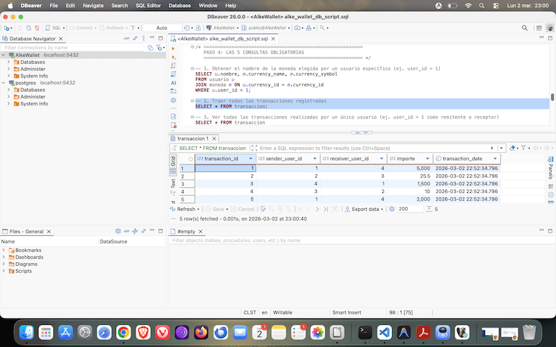

    3. Transacciones de un usuario:
    📸 [Captura de pantalla del resultado de la consulta]
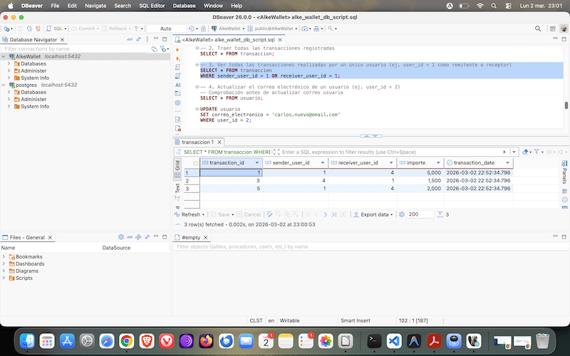

    4. Actualizar correo:
    📸 [Capturas de pantalla del usuario ANTES y DESPUÉS del update]
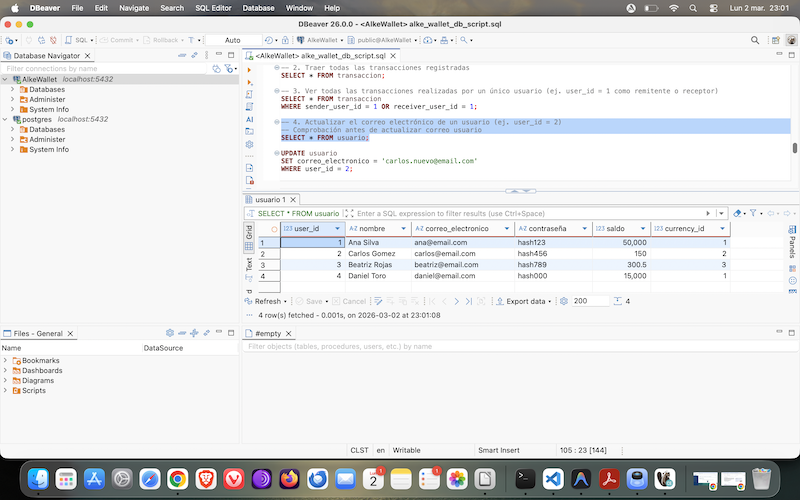

    5. Eliminar transacción:
    📸 [Capturas de pantalla de las transacciones ANTES y DESPUÉS del delete]
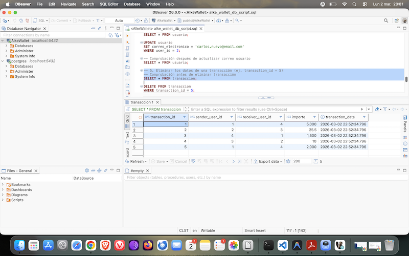

5. Transaccionalidad (ACID)
    1. Prueba de COMMIT:
    📸 [Captura de pantalla mostrando los saldos actualizados y la nueva transacción tras el COMMIT]
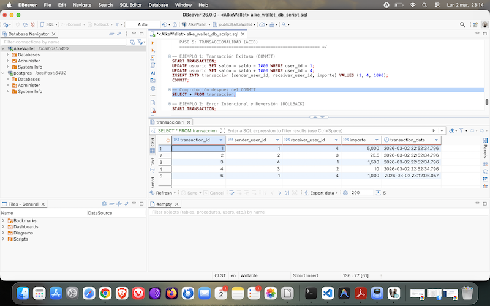

    2. Prueba de ROLLBACK:
    📸 [Capturas de pantalla mostrando el error de la llave foránea y el mensaje exitoso del ROLLBACK]
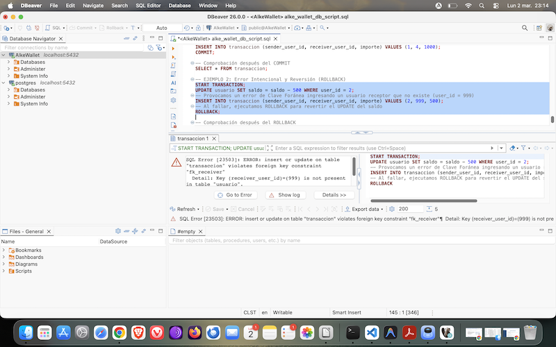
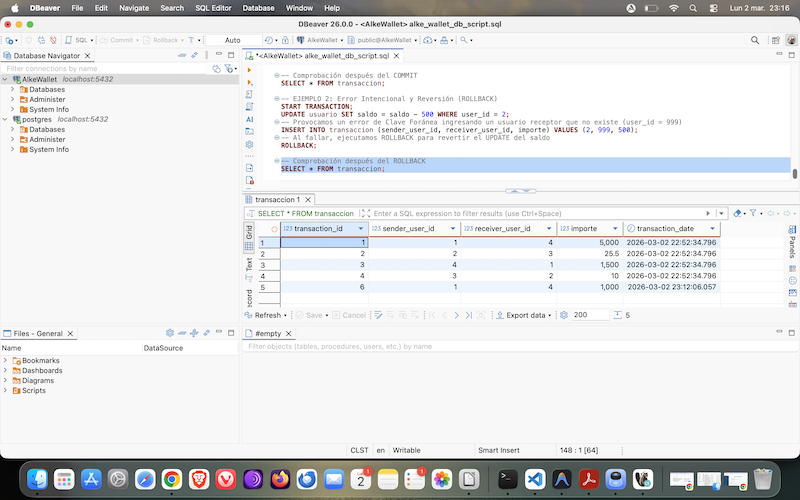

6. Diagrama ER
📸 [Imagen del Diagrama Entidad-Relación exportado desde dbdiagram.io mostrando claramente que usuario tiene una FK hacia moneda y que transaccion tiene dos FK hacia usuario]
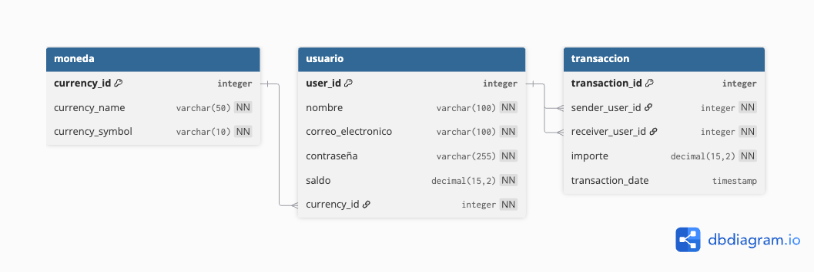
